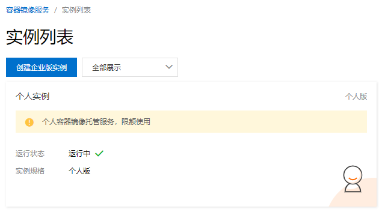

# tyr
把k8s.gcr.io的镜像同步到acr


## 创建acr



## ACR快速测试
```sh
registry="registry.cn-hongkong.aliyuncs.com" #your_acr_registry
docker login ${registry} --username=[your_aliyun_account]
# Password: ******
# WARNING! Your password will be stored unencrypted in /root/.docker/config.json.
# Configure a credential helper to remove this warning. See
# https://docs.docker.com/engine/reference/commandline/login/#credentials-store

# Login Succeeded

docker pull nginx:1.21.3-alpine
docker tag nginx:1.21.3-alpine ${registry}/[your_acr_namespace]/nginx:1.21.3-alpine
docker push ${registry}/[your_acr_namespace]/nginx:1.21.3-alpine
# The push refers to repository [registry.cn-hongkong.aliyuncs.com/[your_acr_namespace]/nginx]
# 40403bebe4fd: Pushed 
# b4b4e85910ea: Pushed 
# 311d8db33235: Pushed 
# 20d0effdf3a2: Pushed 
# e6d3cea19fef: Pushed 
# e2eb06d8af82: Pushed 
# 1.21.3-alpine: digest: sha256:af466e4f12e3abe41fcfb59ca0573a3a5c640573b389d5287207a49d1324abd8 size: 1568

# then check your acr personal instance, should found a nginx image in your namespace
```


